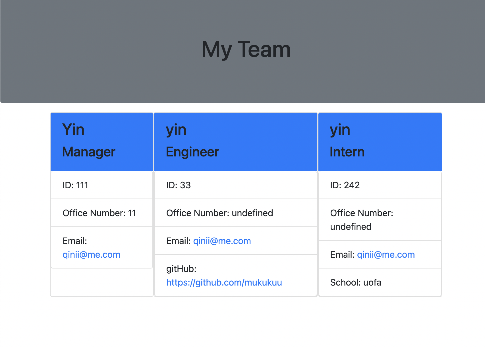

# mi-team-profile-generator

Links to demonstration video:

https://watch.screencastify.com/v/SBnM783mef58N1Z4NNOO

## Table of contents

* [Installation](#installation)
* [Usage](#usage)
* [License](#license)
* [Description](#Description)
* [Contribution](#Contribution)
* [Test](#Test)
* [AskMe](#AskMe)
* [Email](#Email)

## License

 

N/A

## Description
this application can generate a webpage that displays my team's basic info

## Installation
clone code to local machine

Follow instructions to install
clone code to local machine

## Usage
team profile generation

## Contribution
N/A

## Test
run npm test type in cli : npm run test

## Ask Me
Ways of contact:
GitHub: https://github.com/https://github.com/mukukuu
Email Address: qinii@me.com
